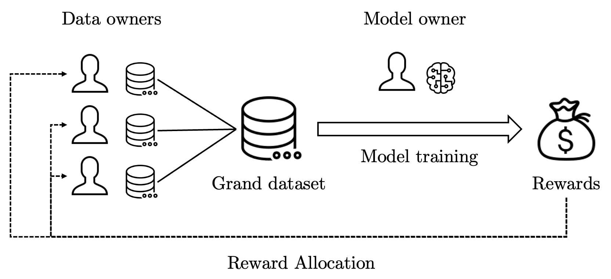

# URDaVa: Unlearning-Robust Data Valuation

Over the years, machine learning has been widely used in both industrial and scientific research. Since machine learning heavily relies on data, model owners often need to collaborate with various data owners to obtain sufficiently many data. 

As different data make different levels of contribution to the model, model owners need to know the value of data so that they can fairly compensate each data owner for their data. This has led to the development of various data valuation techniques and most of them measure the contribution of data to model performance. Meanwhile, the introduction of new data protection and privacy regulations around the world brings challenges to model owners today since it becomes mandatory for them to remove the impact of some data from their models when requested. A robust model that does not lose much performance upon data removal is thus needed and data that contribute to model robustness should be awarded with higher value. Therefore, we propose **DeRDaVa***, an unlearning-robust data valuation technique based on cooperative game theory.

**DeRDaVa can be pronounced as dur-DAH-vah.*
